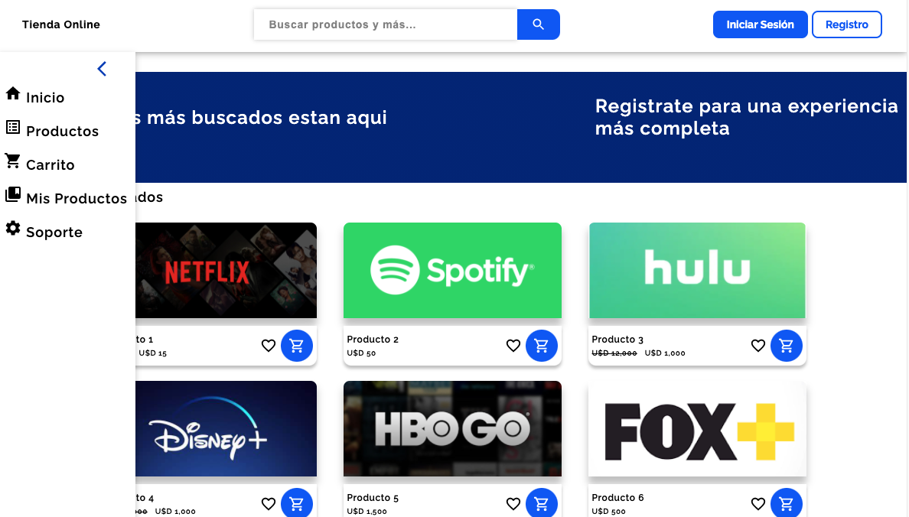
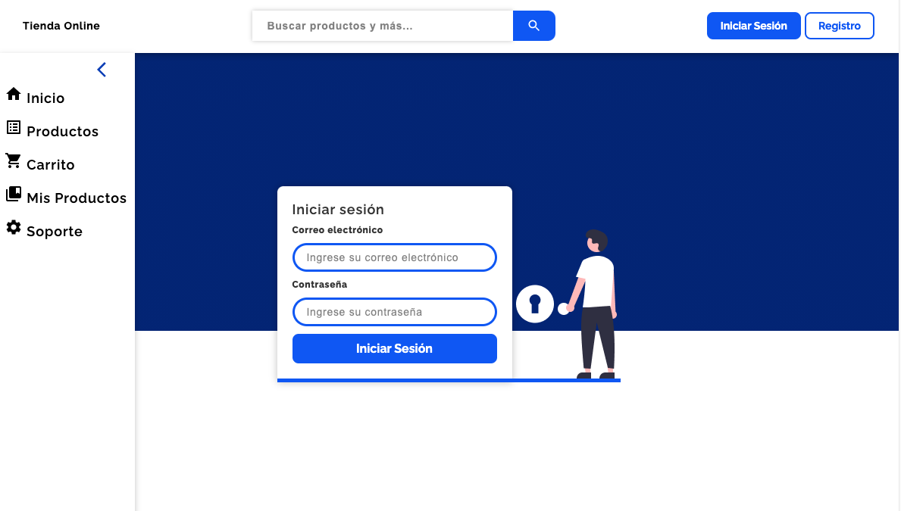
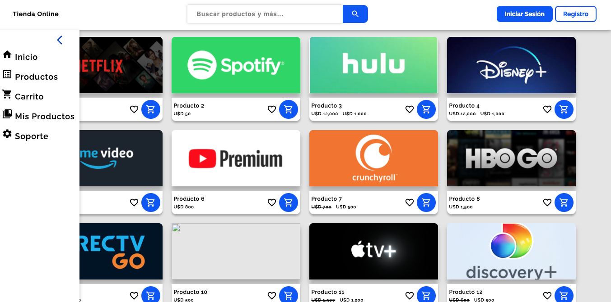

# TiendaOnline Front-End
Frontend for an eCommerce store created using ReactJs⚛️: practice project using styled components, material ui.

HOME PAGE 

LOGIN

PRODUCTS SECTION 

# Getting Started

Install Packages
### `npm install`

Start React App
### `npm start`
The app runs on port 3000 for default

# Build App 

### `npm run build`

